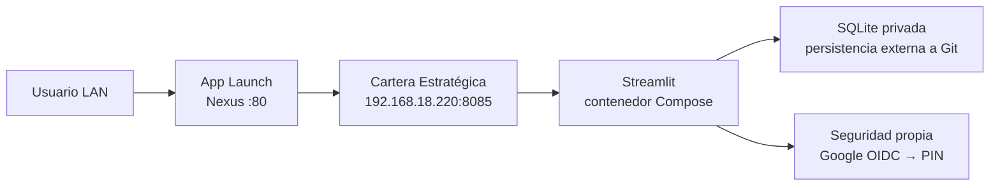
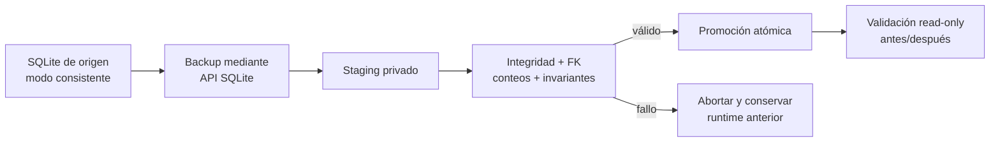

# Aplicación · Cartera Estratégica

Aplicación privada de análisis y seguimiento financiero desarrollada con Python y Streamlit. La versión pública del producto es **v1.0.0** y su runtime canónico está en Nexus, accesible solo desde la LAN.

## Accesos

- **Ficha técnica:** [HTML autocontenido](/downloads/apps/cartera-estrategica.html)
- **Aplicación / Nexus LAN:** [Cartera Estratégica](http://192.168.18.220:8085/)
- **Entrada de navegación:** [App Launch](http://192.168.18.220/) en el puerto canónico `80`.
- **Repositorio:** `ratienza/cartera-estrategica`.

No existe todavía una URL pública de Cartera Estratégica. El bind del servicio se limita a `192.168.18.220:8085`; no hay exposición directa a Internet.

## Estado validado

| Campo | Estado |
|---|---|
| Versión | `v1.0.0` cerrada y aprobada |
| Fuente desplegada | GitHub `main` · `721338b` |
| Host / runtime | Nexus · Docker Compose · proyecto `cartera-estrategica` |
| Persistencia | SQLite privada fuera de Git y del ciclo de vida del contenedor |
| Recuperación | `restart: unless-stopped` |
| Acceso LAN | `http://192.168.18.220:8085` · HTTP `200` validado el 12/09/2026 |
| Suite de producto | 384 pruebas superadas y 1 opcional omitida |
| Esquema | Sin nueva migración para CE-SEC-001 |

La base SQLite real se migró íntegramente mediante una copia consistente y superó las validaciones de integridad, claves foráneas, conteos e invariantes. La demo anterior quedó archivada y recuperable. Bases, secretos, copias y exportaciones reales permanecen fuera de Git.

## Arquitectura LAN



App Launch solo proporciona navegación. Cartera mantiene su propio runtime, datos y controles de acceso.

## Seguridad · CE-SEC-001

CE-SEC-001 está **implementado en `main`, cubierto por pruebas y desplegado en Nexus**:

- El PIN funciona de forma independiente y se almacena únicamente como hash `scrypt` con sal aleatoria, nunca en claro.
- La configuración manual está en `Configuración → Seguridad → PIN`.
- `Habilitar Google OAuth` permanece desactivado durante la etapa LAN.
- Google OIDC exige HTTPS, callback `/oauth2callback`, correo verificado y allowlist; si la configuración está incompleta, falla de forma cerrada.
- Client ID, client secret, cookie secret, allowlist y configuración privada permanecen fuera de Git.
- Cuando Google OIDC y PIN estén activos, el orden será primero Google y después PIN.

La funcionalidad de PIN está desplegada, pero Codex no creó, solicitó ni registró el PIN del usuario. Google OIDC está preparado en código; no se declara activo ni validado extremo a extremo hasta disponer de URL HTTPS, callback registrado y secretos externos.

## Migración controlada de la base

El procedimiento aplicado separa siempre origen, staging, promoción y recuperación:



La comprobación abarca las tablas operativas y de trazabilidad —operaciones, movimientos de cash, lotes y consumos FIFO, ajustes de coste, valoraciones y snapshots— sin publicar conteos ni importes financieros.

## Operación segura

### Arranque y comprobación

Desde el checkout canónico de Nexus:

```bash
git switch main
git pull --ff-only origin main
docker compose up -d --build
docker compose ps
docker compose logs --tail 50
curl --fail http://192.168.18.220:8085/
```

### Actualización

1. Confirmar checkout limpio y `main` sincronizado.
2. Crear una copia consistente de SQLite mediante su API de backup.
3. Validar la copia en staging: integridad, claves foráneas, conteos e invariantes.
4. Reconstruir y recrear únicamente el proyecto Compose de Cartera.
5. Validar HTTP, seguridad y base en modo solo lectura.
6. Comparar los conteos e invariantes antes y después.

### Backup, restauración y recuperación

- Guardar bases y copias en almacenamiento privado, nunca en Git.
- Restaurar primero sobre staging y validar antes de promover.
- Promover por sustitución atómica, conservando una copia recuperable del estado anterior.
- Si la validación falla, mantener o restaurar el runtime y la base anteriores; no improvisar migraciones manuales.
- Para rollback de código, revertir mediante rama/PR y desplegar de nuevo desde `main`; no usar la base como mecanismo de rollback de código.

Está prohibido versionar bases SQLite, Excel, CSV, `.env`, credenciales, secretos, backups o exportaciones de cartera.

## Alcance pendiente

La v1.0 LAN está cerrada. Para la publicación externa queda únicamente el trabajo operativo descrito en [Pendientes · Cartera Estratégica](/pendientes/cartera-estrategica/): URL HTTPS mediante el Tunnel existente, alta externa de OAuth, activación y validación. No requiere cambios de código, migraciones ni rediseño.

Durante el despliegue LAN no se modificaron Cloudflare, DNS, Access, Tunnel ni el router. Los servicios `8081–8084` permanecieron sin cambios.
