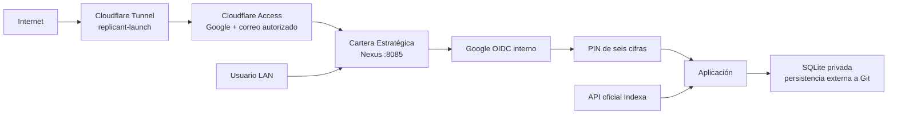
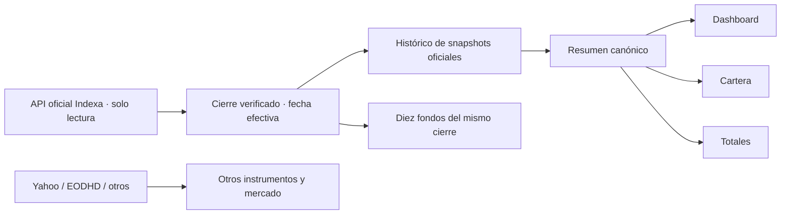

# Aplicación · Cartera Estratégica

Aplicación privada de análisis y seguimiento financiero desarrollada con Python y Streamlit. Su runtime productivo v2.0.0 se ejecuta en Nexus. El PR #27 integró la entrega en `ratienza/cartera-estrategica`; `main`, tag y release `v2.0.0` señalan `c672eb1cadfcb191aaff6db8aeb1ed783321b692`. El 04/10/2026 se verificó ese SHA en el checkout y el contenedor saludable de Nexus, con HTTP `200` en `:8085`.

## Accesos

- **Ficha técnica:** [HTML autocontenido](/downloads/apps/cartera-estrategica.html)
- **Aplicación / LAN:** [Cartera Estratégica](http://192.168.18.220:8085/)
- **Aplicación / Internet:** [Cartera Estratégica](https://cartera.thereplicantlab.com/)
- **Entrada de navegación LAN:** [App Launch](http://192.168.18.220/) en el puerto canónico `80`.
- **Repositorio:** [ratienza/cartera-estrategica](https://github.com/ratienza/cartera-estrategica) · [release v2.0.0](https://github.com/ratienza/cartera-estrategica/releases/tag/v2.0.0).

La URL pública se publica exclusivamente mediante el Tunnel existente y no convierte el bind LAN en una exposición directa a Internet. App Launch es una entrada de navegación y enlaza esta ficha.

## Estado validado

| Campo | Estado |
|---|---|
| Host / runtime | Nexus · Docker Compose · proyecto `cartera-estrategica` |
| Persistencia | SQLite privada real mediante `CARTERA_DB_PATH`, fuera de Git y del contenedor; `cartera-demo.db` es solo el nombre heredado |
| Recuperación | `restart: unless-stopped` |
| Acceso LAN | `http://192.168.18.220:8085` · HTTP `200` validado |
| Acceso público | `https://cartera.thereplicantlab.com` · HTTPS mediante Tunnel y Access |
| Seguridad | Cloudflare Access → Google OIDC interno → PIN de seis cifras |
| Release | `v2.0.0` · `c672eb1cadfcb191aaff6db8aeb1ed783321b692` |
| Datos | Base real preservada; ningún dato financiero se publica aquí |

Las bases, secretos, copias y exportaciones reales permanecen fuera de Git. No se publican rutas privadas, valores de configuración ni datos financieros.

## Funcionalidades

Las diez secciones son **Dashboard**, **Cartera actual**, **Objetivos**, **Rotaciones**, **Análisis técnico**, **Mercado**, **Operaciones**, **Cash**, **Importación y conciliación** y **Configuración**. Dashboard resume el estado; Cartera incluye la composición y el detalle de Indexa. La ficha portable está disponible en [HTML](/downloads/apps/cartera-estrategica.html) y [PDF](/downloads/apps/cartera-estrategica.pdf).

## Arquitectura y acceso

```mermaid
flowchart LR
    I["Internet"] --> T["Cloudflare Tunnel<br/>replicant-launch"]
    T --> A["Cloudflare Access<br/>Google + correo autorizado"]
    A --> CE["Cartera Estratégica<br/>Nexus :8085"]
    CE --> O["Google OIDC interno"]
    O --> P["PIN de seis cifras"]
    P --> APP["Aplicación"]
    APP --> DB["SQLite privada<br/>persistencia externa a Git"]
    L["Usuario LAN"] --> CE
    API["API oficial Indexa"] --> APP
```

La URL LAN y la URL pública son accesos distintos al mismo runtime. Cloudflare Access es la protección de borde del hostname público; Google OIDC y el PIN son controles internos de Cartera. La SQLite no se expone mediante ninguna de las dos rutas.

## Seguridad · CE-SEC-001

CE-SEC-001 está implementado, desplegado y validado en el flujo manual real:

- Cloudflare Access protege primero el hostname público y solo permite el correo autorizado.
- Cartera exige después su propio Google OIDC con callback HTTPS registrado.
- Tras OIDC, Cartera exige un PIN de exactamente seis cifras antes de mostrar datos.
- El PIN se conserva solo como hash seguro; su valor no se documenta, registra ni versiona.
- Toda configuración sensible permanece fuera de Git y no se documenta.

La validación manual real confirma el orden **Cloudflare Access → Google OIDC interno → PIN → Cartera**. Las dos capas de Google son deliberadamente independientes: comparten proveedor de identidad, pero no comparten sesión de autorización de la aplicación.

## Flujo de datos de Indexa v2.0.0

```mermaid
flowchart LR
    API["API oficial Indexa · solo lectura"] --> C["Cierre verificado · fecha efectiva"]
    C --> H["Histórico de snapshots oficiales"]
    H --> R["Resumen canónico"]
    R --> D["Dashboard"]
    R --> P["Cartera"]
    R --> T["Totales"]
    C --> F["Diez fondos del mismo cierre"]
    EXT["Yahoo / EODHD / otros"] --> O["Otros instrumentos y mercado"]
```

La API oficial verificada es la única fuente del saldo, flujos, métricas y diez fondos de Indexa. La fecha de petición y la fecha efectiva del cierre no son equivalentes. El refresco se intenta al abrir o recargar sesión y mediante botón; **no existe tarea diaria autónoma**. Si falla, se conserva el último cierre API verificado con su fecha o se muestra «sin dato oficial». Yahoo, EODHD, Morningstar y NAV de fondos no sustituyen ni completan el valor oficial. La API observada no aporta P&G fiable por fondo: no se infiere ni se muestra. Los proveedores externos siguen sirviendo a otros instrumentos sin contaminar Indexa ni los totales oficiales.

## Operación segura

Antes de un despliegue funcional, fijar el commit o tag aprobado, crear un backup SQLite consistente externo con la API de backup y verificar su restaurabilidad, `integrity_check`, huella, tamaño y conteos financieros. Tras el despliegue comprobar el mismo montaje de `CARTERA_DB_PATH`, integridad y conteos, imagen/SHA, HTTP, OAuth y PIN. No ejecutar migraciones implícitas. La documentación se despliega por separado y no reinicia Cartera. [Mantenimiento](https://docs.thereplicantlab.com/operacion/mantenimiento/) y [Docker](https://docs.thereplicantlab.com/despliegue/docker/) contienen el procedimiento general.

Para una comprobación pública se valida primero Cloudflare Access; no se introducen credenciales, PIN ni secretos en logs o procedimientos versionados. Ante un fallo de runtime se revierte únicamente la imagen o contenedor anterior; no se usa la base como mecanismo de rollback de código. Restaurar datos es una operación distinta, autorizada y probada. HTTP `200` no equivale a validar una sesión autenticada.

Está prohibido versionar bases SQLite, Excel, CSV, `.env`, credenciales, secretos, backups o exportaciones de cartera.

## Pendientes

No queda un pendiente bloqueante específico de publicación o autenticación de Cartera. Las mejoras no bloqueantes y la operación general del Tunnel se mantienen, si proceden, en sus páginas correspondientes.

Las actas de [12/09/2026](https://docs.thereplicantlab.com/cambios/2026-09-12/) y [RL-CE-DOC-001](https://docs.thereplicantlab.com/encargos/RL-CE-DOC-001/) son históricas; sus estados v1 y Google desactivado no describen v2.0.0.
