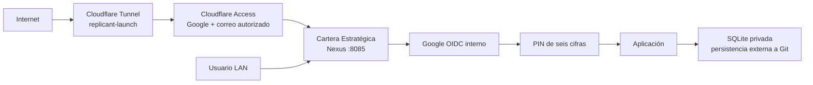
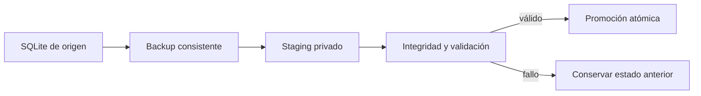

# Aplicación · Cartera Estratégica

Aplicación privada de análisis y seguimiento financiero desarrollada con Python y Streamlit. Su runtime canónico se ejecuta en Nexus y se publica de forma privada.

## Accesos

- **Ficha técnica:** [HTML autocontenido](/downloads/apps/cartera-estrategica.html)
- **Aplicación / LAN:** [Cartera Estratégica](http://192.168.18.220:8085/)
- **Aplicación / Internet:** [Cartera Estratégica](https://cartera.thereplicantlab.com/)
- **Entrada de navegación LAN:** [App Launch](http://192.168.18.220/) en el puerto canónico `80`.
- **Repositorio:** `ratienza/cartera-estrategica`.

La URL pública se publica exclusivamente mediante el Tunnel existente y no convierte el bind LAN en una exposición directa a Internet. App Launch no se ha modificado: sigue siendo solo una entrada de navegación LAN.

## Estado validado

| Campo | Estado |
|---|---|
| Host / runtime | Nexus · Docker Compose · proyecto `cartera-estrategica` |
| Persistencia | SQLite privada fuera de Git y del ciclo de vida del contenedor |
| Recuperación | `restart: unless-stopped` |
| Acceso LAN | `http://192.168.18.220:8085` · HTTP `200` validado |
| Acceso público | `https://cartera.thereplicantlab.com` · HTTPS mediante Tunnel y Access |
| Seguridad | Cloudflare Access → Google OIDC interno → PIN de seis cifras |
| Datos | SQLite, migraciones y datos financieros preservados e íntegros |

Las bases, secretos, copias y exportaciones reales permanecen fuera de Git. No se publican rutas privadas, valores de configuración ni datos financieros.

## Arquitectura y acceso


```mermaid
flowchart LR
    I["Internet"] --> T["Cloudflare Tunnel<br/>replicant-launch"]
    T --> A["Cloudflare Access<br/>Google + correo autorizado"]
    A --> CE["Cartera Estratégica<br/>Nexus :8085"]
    CE --> O["Google OIDC interno"]
    O --> P["PIN de seis cifras"]
    P --> APP["Aplicación"]
    APP --> DB["SQLite privada<br/>persistencia externa a Git"]
    L["Usuario LAN"] --> CE
```

La URL LAN y la URL pública son accesos distintos al mismo runtime. Cloudflare Access es la protección de borde del hostname público; Google OIDC y el PIN son controles internos de Cartera. La SQLite no se expone mediante ninguna de las dos rutas.

## Seguridad · CE-SEC-001

CE-SEC-001 está implementado, desplegado y validado en el flujo manual real:

- Cloudflare Access protege primero el hostname público y solo permite el correo autorizado.
- Cartera exige después su propio Google OIDC con callback HTTPS registrado.
- Tras OIDC, Cartera exige un PIN de exactamente seis cifras antes de mostrar datos.
- El PIN se conserva solo como hash seguro; su valor no se documenta, registra ni versiona.
- Toda configuración sensible permanece fuera de Git y no se documenta.

La validación manual real confirma el orden **Cloudflare Access → Google OIDC interno → PIN → Cartera**. Las dos capas de Google son deliberadamente independientes: comparten proveedor de identidad, pero no comparten sesión de autorización de la aplicación.

## Migración controlada de la base


```mermaid
flowchart LR
    O["SQLite de origen"] --> B["Backup consistente"]
    B --> S["Staging privado"]
    S --> V["Integridad y validación"]
    V -->|válido| P["Promoción atómica"]
    V -->|fallo| R["Conservar estado anterior"]
```

La publicación actual no modificó esta base, sus migraciones ni sus datos.

## Operación segura

Desde el checkout canónico de Nexus:

```bash
git switch main
git pull --ff-only origin main
docker compose up -d --build
docker compose ps
curl --fail http://192.168.18.220:8085/
```

Para una comprobación pública se valida primero Cloudflare Access; no se introducen credenciales, PIN ni secretos en logs o procedimientos versionados. Ante un fallo de runtime se revierte únicamente la imagen o contenedor anterior; no se usa la base como mecanismo de rollback de código.

Está prohibido versionar bases SQLite, Excel, CSV, `.env`, credenciales, secretos, backups o exportaciones de cartera.

## Pendientes

No queda un pendiente bloqueante específico de publicación o autenticación de Cartera. Las mejoras no bloqueantes y la operación general del Tunnel se mantienen, si proceden, en sus páginas correspondientes.

Durante esta publicación no se modificaron App Launch, los servicios `8081–8084`, Cloudflare, DNS, el Tunnel, el router, la SQLite ni datos financieros.
