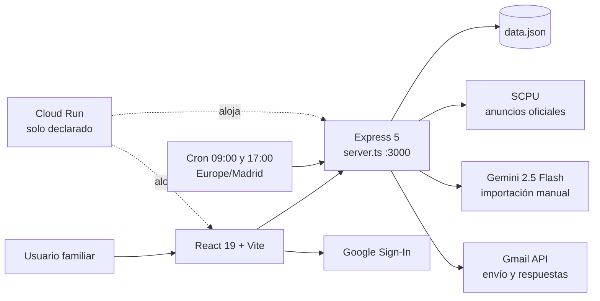

# PULA

Auditoría técnica y manual funcional de `ratienza/Pula`. **PULA es exclusivamente una POC privada para localizar y gestionar apartamentos de la web oficial SCPU en Pula, Croacia.** Su finalidad actual es ayudar en una búsqueda familiar concreta; no es ErasmusHomes ni una plataforma paneuropea.

!!! warning "Alcance de este documento"
    **PULA es una POC privada de búsqueda de apartamentos SCPU en Pula, Croacia. No forma parte de ErasmusHomes.**

## Estado comprobado

| Elemento | Evidencia |
|---|---|
| Repositorio | [`ratienza/Pula`](https://github.com/ratienza/Pula) · privado |
| `main` auditado | `ff8165cf7c9d1d4c5ae670c56486c25900a5754b` |
| Alcance funcional | Búsqueda SCPU, gestión de candidatos, contacto y seguimiento Gmail |
| Checkout Nexus | `/opt/apps/Pula` · limpio y sincronizado; copia de consulta, no runtime validado |
| Producción | Cloud Run declarado por el proyecto; no inspeccionado ni modificado |
| Pruebas locales | TypeScript y build Vite/esbuild correctos sobre copia temporal |
| Tests automatizados | No existe suite; solo scripts exploratorios de scraping/Firebase |
| Datos versionados | `data.json`: 29 registros `new` con 29 direcciones de contacto |

Calidad general: **5/10**. La POC compila y concentra el flujo funcional para Pula, pero carece de tests, control de acceso, persistencia robusta y trazabilidad reproducible de Cloud Run.

## Separación obligatoria de proyectos

[`ratienza/ErasmusHomes`](https://github.com/ratienza/ErasmusHomes) es otro repositorio y otro proyecto. Contiene el concepto comercial paneuropeo, el ejemplo visual de Bolonia/UNIBO, Smart Deposit Audit y el dossier ReportLab. Actualmente debe tratarse como **concepto no validado**, no como funcionalidad implementada de PULA.

La etiqueta `v0.1-poc-beta` y los artefactos ErasmusHomes presentes en el historial de `ratienza/Pula` son contaminación histórica y deuda de higiene del repositorio. No definen el alcance de PULA y no se usan como fuente funcional en esta ficha. Cualquier limpieza futura de esa historia o etiqueta requiere un encargo específico sobre el repositorio PULA.
## Arquitectura de `main`



El build ejecuta `vite build` y empaqueta `server.ts` con esbuild como `dist/server.cjs`. El repositorio no contiene Dockerfile, manifiesto Cloud Run, workflow CI ni definición de volumen persistente; Git no permite reproducir ni vincular el despliegue declarado con el SHA auditado.

### Modelo de datos

Cada apartamento registra UUID, casero, superficie, capacidad, precio, ubicación, descripción, email, enlace, condiciones, contrato, estado y fecha. Puede añadir origen manual y datos de respuesta. El enlace funciona como clave de deduplicación.

Estados: `new`, `sent`, `following` y `discarded`.

## Manual funcional de `main`

### Descubrimiento automático

1. **Extraer Nuevos Pisos SCPU** o el cron inicia el proceso.
2. El servidor recorre hasta cinco páginas y limita el lote a 40 enlaces.
3. Cheerio extrae casero, email, precio, superficie, zona y contrato.
4. Se traducen expresiones croatas mediante sustituciones locales.
5. Se excluyen contratos detectados como anuales y se deduplica por URL.
6. El resultado se guarda y aparece en **Nuevas Oportunidades**.

La implementación contradice la afirmación documental “sin límite artificial”: hay un máximo de cinco páginas y 40 enlaces. Además, el scraper fija la capacidad como `Ver descripción`, aunque la regla de interfaz exige un número de personas.

### Importación manual con IA

1. **Add URL ✋** abre el formulario.
2. El backend descarga la URL y elimina etiquetas ruidosas.
3. Envía hasta 12.000 caracteres a Gemini 2.5 Flash con esquema JSON.
4. Si Gemini no está disponible, aplica una heurística.
5. Marca la ficha como manual y deduplica por URL exacta.

No es segura para exposición pública hasta restringir protocolos, DNS/IP, redes privadas, redirecciones, tamaño y tiempo: hoy una petición anónima puede ordenar al servidor descargar una URL arbitraria, creando riesgo de SSRF.
### Contacto y seguimiento Gmail

1. Firebase Google Sign-In entrega un access token conservado en memoria.
2. El backend construye un correo bilingüe inglés/croata y llama a Gmail API.
3. La comprobación revisa hasta 25 hilos y compara remitentes con caseros.
4. Una respuesta mueve un anuncio enviado a `following`.

Existe un defecto de integridad: el endpoint responde `success` y cambia el estado a `sent` incluso si falta un token utilizable o Gmail devuelve un error. “Enviado” no prueba que el correo haya salido.

### Gestión visual

La SPA ofrece Nuevas Oportunidades, En Seguimiento, Enviados sin respuesta e Histórico, orden por fecha o precio y cambio manual de estado. Los botones de producto están presentes. `package.json` usa React 19, aunque la arquitectura escrita declara React 18.

## Material ErasmusHomes excluido

El dossier de Bolonia, los mockups UNIBO, el backend FastAPI de auditoría de fianzas y los generadores ReportLab se excluyen expresamente de la arquitectura, API, puntuación y manual funcional de PULA. Solo se comprobó que su ubicación canónica actual es el repositorio independiente `ratienza/ErasmusHomes`; no se auditó su funcionamiento.
## API REST observada

| Método y ruta | Entrada | Salida y efecto | Autenticación observada | Riesgo principal |
|---|---|---|---|---|
| `GET /api/config` | Ninguna | JSON con `clientId` OAuth | No | Expone configuración cliente; no es un secreto por sí misma |
| `GET /api/apartments` | Ninguna | Devuelve todos los registros | No | Expone contactos y datos operativos sin autorización |
| `POST /api/apartments/scrape` | Ninguna | Consulta SCPU, deduplica y reescribe `data.json` | No | Escritura anónima, sin timeout ni control de concurrencia |
| `POST /api/apartments/manual-url` | JSON `{url}` | Descarga, analiza y añade un candidato | No | SSRF, consumo abusivo y persistencia anónima |
| `POST /api/gmail/check-replies` | Bearer OAuth de Google | Lee hasta 25 hilos y mueve respuestas de `sent` a `following` | Bearer requerido | Token delegado y coincidencias heurísticas de remitente |
| `PUT /api/apartments/{id}/status` | JSON `{status}` | Cambia el estado y reescribe el fichero | No | Mutación anónima y posibles escrituras perdidas |
| `POST /api/apartments/{id}/send` | Bearer opcional; email alternativo opcional | Intenta enviar correo y cambia a `sent` | Opcional en la práctica | Puede declarar éxito aunque Gmail no haya enviado |

No se observan OpenAPI versionado, rate limiting, sesión de aplicación, autorización por usuario ni validación estructural centralizada.

## Datos y persistencia

`data.json` es simultáneamente semilla versionada y base de datos de ejecución. El SHA auditado contiene 29 apartamentos en estado `new` y 29 direcciones de contacto. Cada registro puede incluir identidad del casero, email, enlace, precio, ubicación, descripción, condiciones, contrato, estado, origen manual y metadatos de respuesta.

- **Persistencia implementada:** lectura y escritura síncronas del JSON completo mediante `fs.readFileSync` y `fs.writeFileSync`.
- **Concurrencia:** no hay bloqueo, control de versión ni reemplazo atómico; dos peticiones pueden sobrescribirse.
- **Cloud Run:** el filesystem del contenedor no constituye almacenamiento duradero; Git no define volumen ni servicio externo.
- **Privacidad:** los emails son datos personales y no deberían permanecer en Git ni exponerse por una API anónima.
- **Recuperación:** no existe procedimiento versionado de backup, restauración o migración.

## Seguridad

| Severidad | Hallazgo confirmado | Evidencia | Recomendación futura |
|---|---|---|---|
| Crítica | API de lectura y mutación sin control de acceso | CORS global y rutas de apartamentos sin middleware de autenticación | Autenticación de aplicación y autorización por usuario |
| Alta | SSRF en importación manual | El servidor acepta una URL que empiece por `http` y ejecuta `fetch(url)` | Lista de protocolos, resolución DNS/IP segura, bloqueo de redes privadas, redirecciones y límites |
| Alta | Estado `sent` falso | El bloque normal y el `catch` persisten `sent` incluso sin envío confirmado | Cambiar el estado solo tras respuesta válida de Gmail y registrar el error |
| Alta | Datos personales versionados y expuestos | `data.json` y `GET /api/apartments` | Almacén privado, minimización, control de acceso y retirada del histórico Git mediante encargo específico |
| Media | Escritura no atómica | Se reescribe el JSON completo sin bloqueo | Base de datos persistente o reemplazo atómico con control de concurrencia |
| Media | Ausencia de controles de abuso | Sin rate limiting, timeouts homogéneos ni límite explícito de cuerpo | Límites, timeouts, cabeceras y observabilidad sin datos sensibles |

## Operación reproducible observada

### Requisitos y configuración

- Node.js compatible con las dependencias declaradas; el repositorio conserva `bun.lock`, pero no fija versión de Node ni contiene CI.
- Variables referenciadas: `GEMINI_API_KEY`, `OAUTH_CLIENT_ID`, `NODE_ENV` y `DISABLE_HMR`.
- Los valores reales deben permanecer fuera de Git. `.env.example` solo sirve de inventario y no demuestra una configuración desplegada.

### Construcción y ejecución local documentadas

```bash
npm install
npm run build
npm run start
```

`npm run build` genera el frontend Vite y `dist/server.cjs`; `npm run start` ejecuta el servidor empaquetado en el puerto `3000`. Estos comandos se derivan de `package.json`, pero la prueba previa se realizó sobre una copia temporal y sin invocar servicios externos.

### Limitaciones de despliegue

No existen Dockerfile, manifiesto Cloud Run, healthcheck, volumen persistente, migración ni rollback versionados. Antes de trasladar PULA a DigitalOcean deben definirse imagen reproducible, almacenamiento, secretos, autenticación, proxy/TLS, backup/restore, monitorización y pruebas.

## Riesgos y pendientes reales

### Prioridad alta

- Proteger lecturas y mutaciones con autenticación y autorización.
- Bloquear SSRF en la importación manual.
- Sacar `data.json` y los contactos del repositorio; tratar los emails como datos personales.
- No marcar `sent` tras error o ausencia de Gmail.
- Definir persistencia compatible con Cloud Run y operaciones concurrentes.
- Aportar un despliegue reproducible que vincule imagen y runtime con un SHA Git.

### Prioridad media

- Usar bloqueo y reemplazo atómico en vez de escrituras síncronas directas.
- Restringir CORS, limitar cuerpos y cargas, añadir rate limiting y cabeceras.
- Validar HTTP del scraper, fijar timeouts y evitar logs OAuth detallados.
- Añadir tests unitarios, API, scraper con fixtures, Gmail simulado y CI.
- Elegir y fijar un único gestor de dependencias y lockfile.

### Deriva documental

- Arquitectura: React 18; manifiesto: React 19.
- Documentación: scraping ilimitado; código: cinco páginas y 40 enlaces.
- `AGENTS.md` reserva Gmail y URL manual para v2.0; ambos ya están en `main`.
- La etiqueta y los artefactos ErasmusHomes están depositados en el historial de PULA pese a pertenecer al repositorio independiente `ratienza/ErasmusHomes`.
- Regla visual: prohíbe `Ver descripción`; el scraper lo asigna a `size`.
- Cloud Run y Nginx declarados sin Dockerfile ni configuración reproducible.
- La automatización Python usa mock, OAuth local y `TEST_MODE = True`; no pertenece al runtime Express demostrado.

## Pruebas y límites

- ✅ Checkout Nexus limpio y sincronizado.
- ✅ Instalación temporal, `tsc --noEmit` y build Vite/esbuild.
- ⚠️ No existe suite automatizada.
- ⚠️ No se llamó a SCPU, Gemini, Gmail, Firebase ni datos vivos.
- ⚠️ Cloud Run no fue inspeccionado ni validado.
- ⚠️ ErasmusHomes solo se consultó para confirmar la separación; no fue auditado.
- ⚠️ No se ejecutaron los scripts `test-*`: son comprobaciones exploratorias con acceso a datos o servicios, no una suite aislada.

## Operación futura y traslado

Antes de DigitalOcean se necesitan runtime reproducible, almacenamiento persistente, secretos fuera de Git, autenticación, backup/restore, healthcheck y tests. No deben reutilizarse datos o credenciales de Cloud Run implícitamente.

`Checkout ≠ Runtime`: PULA no se desplegó en Nexus. Cloud Run no se tocó.
