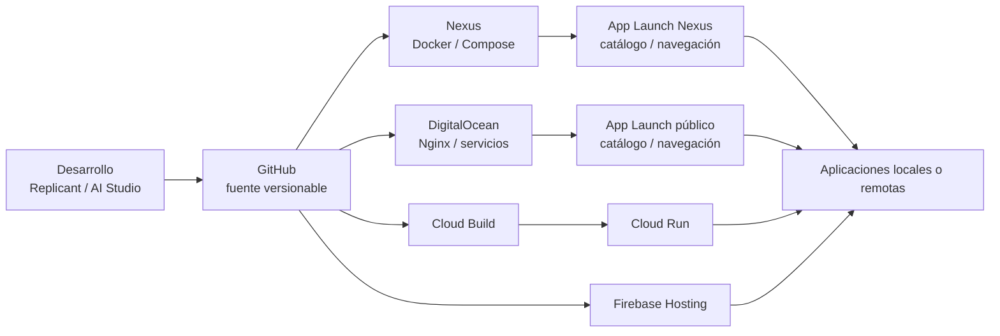
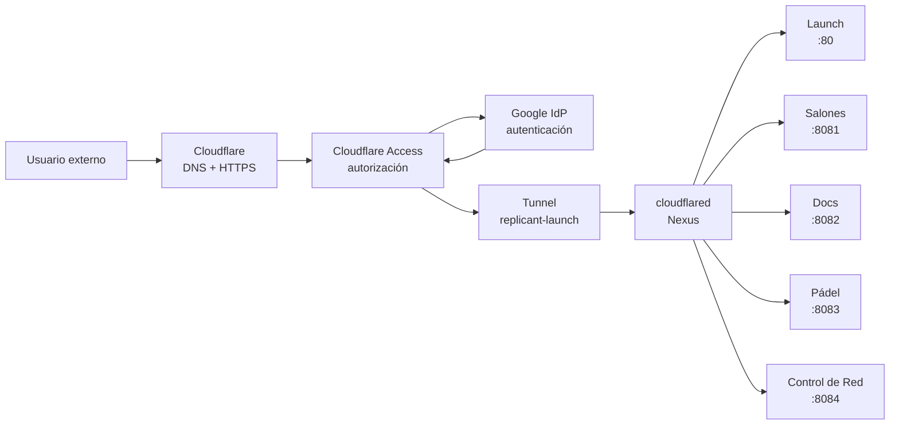
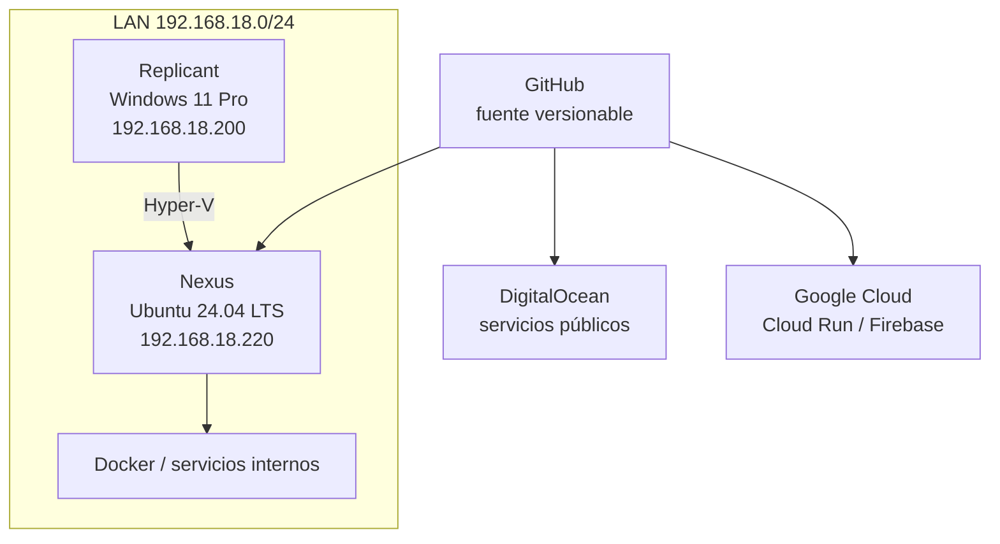
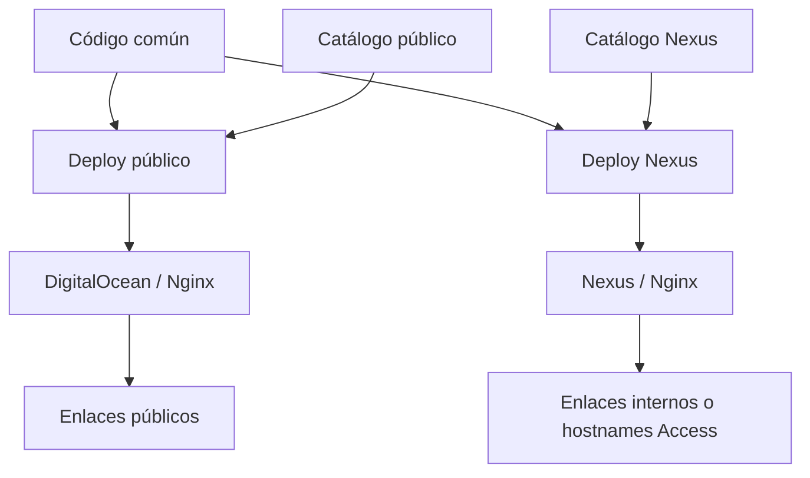

# Arquitectura

## Modelo general

Replicant Lab separa cuatro planos: **desarrollo y código**, **runtimes**, **navegación** y **acceso externo**. App Launch es un catálogo; no ejecuta las aplicaciones enlazadas.

### Lectura del diagrama

- **GitHub** es la fuente versionable.
- **Nexus**, **DigitalOcean**, **Cloud Run** y **Firebase Hosting** son destinos de ejecución o publicación; no son intercambiables.
- **App Launch** es navegación. Una tarjeta puede apuntar a un servicio local, a un hostname protegido por Cloudflare o a un servicio cloud.
- **Cloudflare** no es un runtime de las aplicaciones: aporta publicación, seguridad perimetral e identidad para los servicios seleccionados de Nexus.

## Acceso externo seguro a Nexus

La publicación externa de Nexus usa **un único Cloudflare Tunnel**. El conector `cloudflared` se ejecuta en Nexus y mantiene una conexión saliente; el router doméstico no publica puertos entrantes.

El orden lógico es **HTTPS/DNS → Access → Google IdP → política Access → Tunnel → origen Nexus**. El Tunnel transporta tráfico; **no autentica usuarios**.

Cada hostname tiene una aplicación y una política Access independientes. Compartir el mismo Tunnel no implica compartir autorización.

| Servicio Nexus | Hostname externo | Origen |
|---|---|---|
| App Launch | `launch.thereplicantlab.com` | `http://localhost:80` |
| Salones AV | `salones.thereplicantlab.com` | `http://192.168.18.220:8081` |
| Replicant Lab | `docs.thereplicantlab.com` | `http://192.168.18.220:8082` |
| Reserva Pistas UTP | `padel.thereplicantlab.com` | `http://192.168.18.220:8083` |
| Control de Red | `red.thereplicantlab.com` | `http://192.168.18.220:8084` |

## LAN y host físico

Los accesos LAN por IP y puerto permanecen independientes de Cloudflare Access. No se ha introducido HTTPS interno ni un DNS local nuevo.

## App Launch multientorno

El catálogo se selecciona durante el despliegue. Cada host recibe únicamente su `apps.json`; la lógica visual es común.

## Responsabilidades

| Elemento | Responsabilidad |
|---|---|
| Replicant | Estación principal Windows, desarrollo local, Hyper-V y administración |
| Nexus | Laboratorio Linux, Docker, servicios internos y origen de servicios publicados mediante Tunnel |
| GitHub | Código, configuración versionable e histórico |
| DigitalOcean | Servicios públicos 24×7 y App Launch público |
| Google Cloud Run | Producción canónica de Consumos Cupra |
| Firebase Hosting | Producción pública del CV |
| Cloudflare DNS / HTTPS | Entrada pública y terminación HTTPS de los hostnames del Lab |
| Cloudflare Access | Autorización independiente por aplicación/hostname |
| Google IdP | Autenticación de identidad para Access |
| Cloudflare Tunnel | Transporte saliente seguro entre Cloudflare y Nexus |
| App Launch | Catálogo y navegación hacia aplicaciones locales o remotas |
| `/opt/data`, `/opt/secrets`, `/opt/backups` | Datos, secretos y copias fuera de Git |

!!! important "Reglas de lectura"
    `Checkout ≠ Runtime` · `Tarjeta App Launch ≠ Runtime local` · `Tunnel ≠ Autenticación`.

Docker es el patrón preferido para servicios internos de Nexus cuando encaja, no un requisito universal para todas las aplicaciones.

## Estado actual de seguridad externa

**Implementado:** Cloudflare Tunnel, cinco hostnames, Google como IdP y una aplicación/política Access independiente por hostname.

**Pendiente operativo:** desplegar el catálogo Nexus corregido de `Apps_Lauch#15`, validar desde móvil cada aplicación protegida y añadir monitorización/alertas del Tunnel.

Authentik queda como evolución opcional futura; no forma parte del runtime actual.

La guía operativa y de recuperación está en [Cloudflare Tunnel](red/cloudflare-tunnel.md).
