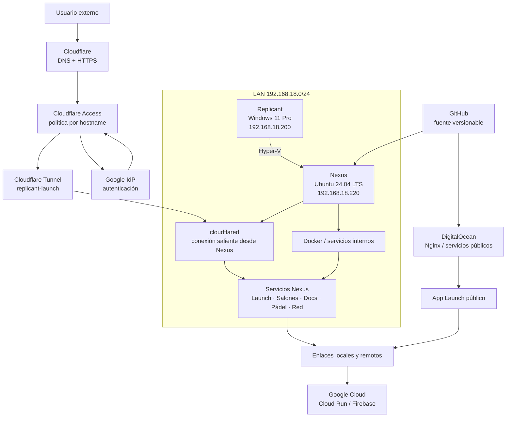
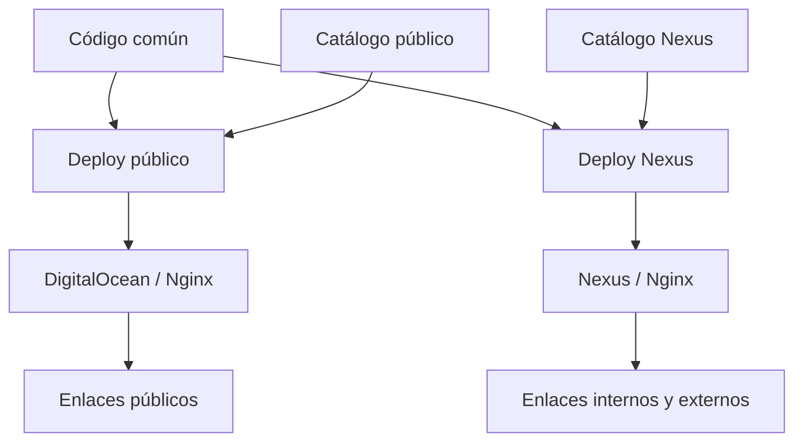

# Arquitectura

## Modelo general

App Launch es catálogo y capa de acceso. No ejecuta las aplicaciones enlazadas ni demuestra que residan en el mismo host.

## App Launch multientorno

El catálogo se selecciona durante el despliegue. Cada host recibe únicamente su `apps.json`; la lógica visual es común.

## Responsabilidades

| Elemento | Responsabilidad |
|---|---|
| Replicant | Estación principal Windows, desarrollo local, Hyper-V y administración |
| Nexus | Laboratorio Linux, Docker, servicios internos y copias de consulta |
| GitHub | Código, configuración versionable e histórico |
| DigitalOcean | App Launch público, Reservas y otros servicios publicados en el VPS |
| Google Cloud Run | Producción canónica de Consumos Cupra |
| Firebase Hosting | Producción pública del CV |
| App Launch | Catálogo y navegación hacia aplicaciones locales o remotas |
| `/opt/data`, `/opt/secrets`, `/opt/backups` | Datos, secretos y copias fuera de Git |

!!! important "Dos reglas de lectura"
    `Checkout ≠ Runtime` y `Tarjeta App Launch ≠ Runtime local`.

Docker es el patrón preferido para servicios internos de Nexus cuando encaja, no un requisito universal para todas las aplicaciones.

## Publicación externa mediante Cloudflare Tunnel

Nexus mantiene los servicios internos en la LAN. Cloudflare termina DNS/HTTPS, Google identifica al usuario y Access autoriza cada aplicación. El único Tunnel `replicant-launch` transporta mediante la conexión saliente de `cloudflared` las rutas de Launch (`80`), Salones (`8081`), documentación (`8082`), Pádel (`8083`) y Control de Red (`8084`). El router no abre puertos entrantes.

El Tunnel no autentica usuarios: cada hostname tiene su aplicación y política Access independiente. [Cloudflare Tunnel](red/cloudflare-tunnel.md) contiene la topología, operación, recuperación y límites.
