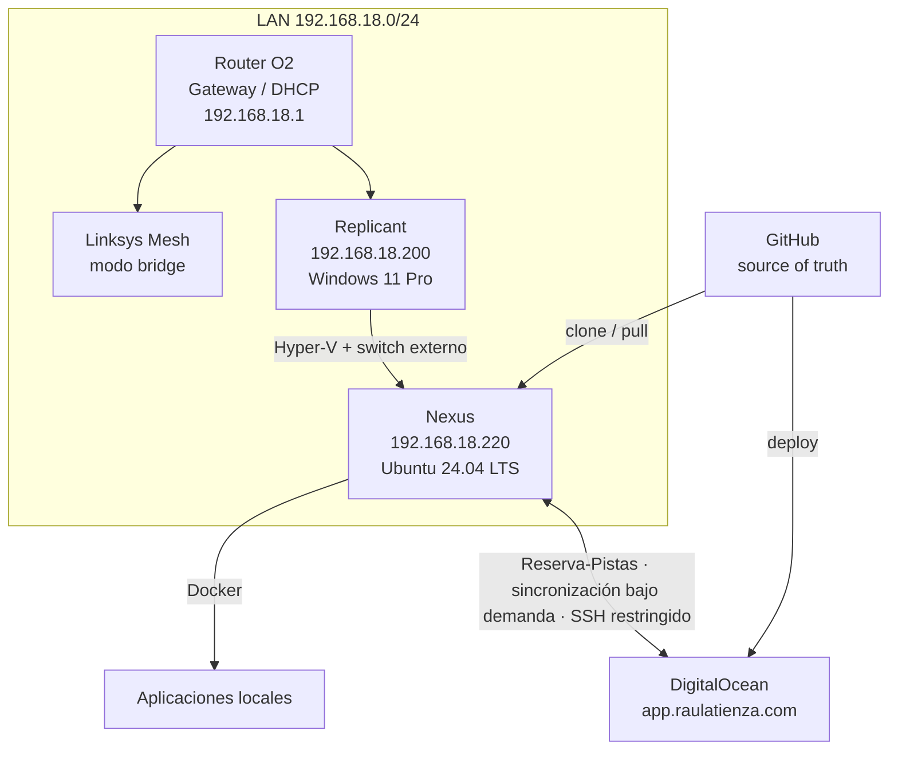
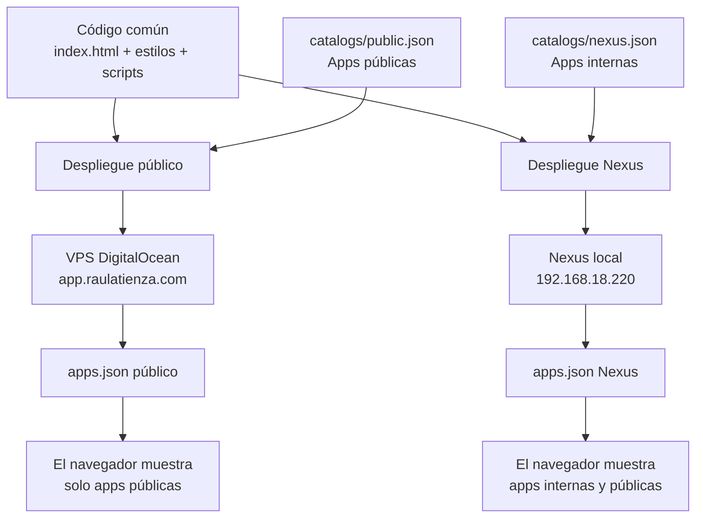

# Arquitectura

## Modelo general

## App Launch multientorno

El catálogo se selecciona durante el despliegue. Cada host recibe únicamente su `apps.json`; la lógica visual no contiene bifurcaciones por entorno.

## Reparto de responsabilidades

| Elemento | Responsabilidad |
|---|---|
| Replicant | Puesto de trabajo, UI, Hyper-V y administración del lab |
| Nexus | Ejecución local de servicios Linux y contenedores |
| GitHub | Código, configuración versionable e histórico |
| DigitalOcean | App Launch público, Reservas, Consumos y copia estática de Salones |
| Google Cloud / Firebase | Producción del CV; no depende de Nexus |
| `/opt/data` | Persistencia local |
| `/opt/secrets` | Secretos y configuración privada fuera de Git |
| `/opt/backups` | Copias; política aún pendiente |

## Regla arquitectónica

!!! success "Regla base"
    Si una necesidad puede resolverse como contenedor sin ensuciar el host, se prefiere Docker. El host Ubuntu se mantiene deliberadamente pequeño.

## Qué no se instala por defecto

- Un servidor DNS local. Replicant usa aliases puntuales en su archivo `hosts`.
- Reverse proxy.
- Portainer, Cockpit o Webmin.
- Fail2ban mientras SSH permanezca restringido a la LAN.
- Suites de monitorización complejas.
- Automatización de backups hasta definir política.
