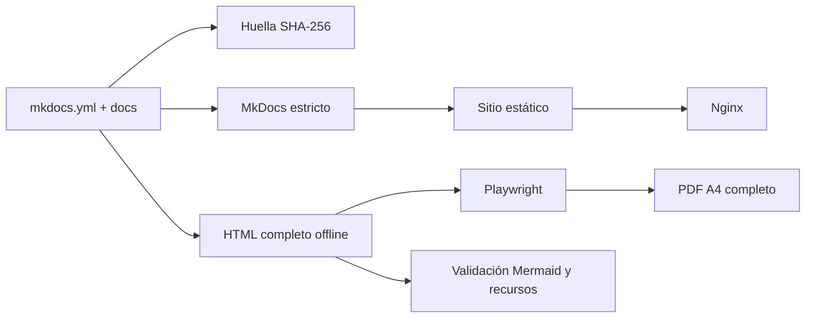

# Autodocumentación

## Estado implementado

La documentación mantiene una fuente humana canónica (`mkdocs.yml`, `docs/` y recursos) y una cadena reproducible para construir el sitio y sus artefactos derivados.

## Herramientas versionadas

- `scripts/docs_pipeline.py`: orquesta construcción, generación, sincronía y validaciones estructurales.
- `scripts/render_portables.mjs`: renderiza Mermaid en Chromium y produce PDF y evidencias.
- `scripts/portable.css`: presentación compartida por HTML offline y PDF.
- `requirements-docs.txt`: dependencias Python exactas.
- `package.json` y `pnpm-lock.yaml`: Mermaid, Playwright y árbol Node fijados.
- `docs/javascripts/mermaid.min.js`: runtime derivado de la versión Mermaid fijada y comprobado contra `node_modules`.

## Huella y reproducibilidad

La huella incluye configuración MkDocs, páginas en `nav`, recursos y herramientas que afectan a los portables. El HTML debe coincidir byte a byte con la salida esperada. El PDF se comprueba mediante esa huella visible, cobertura textual, número de páginas, enlaces y equivalencia de paginación con una regeneración de control.

## Temporales

Todos los resultados intermedios viven bajo `.build/docs-pipeline/`. Entornos virtuales, `node_modules`, navegadores, cachés, capturas y reportes no entran en Git.

## Flujo de actualización

1. modificar exclusivamente fuentes MkDocs;
2. ejecutar `python scripts/docs_pipeline.py generate`;
3. revisar el sitio, HTML, PDF y capturas;
4. ejecutar `python scripts/docs_pipeline.py check`;
5. revisar el diff completo;
6. commit, push y Pull Request;
7. tras merge, reconstruir el servicio estático en Nexus mediante Compose;
8. validar publicación y descargas en Nexus como un estado separado.
