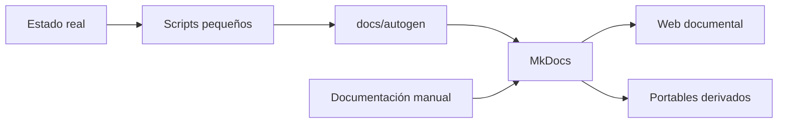

# Autodocumentación

## Estado actual

La documentación tiene hoy una capa humana mantenida en `mkdocs.yml`, `docs/` y sus recursos. No existen scripts versionados, carpeta `docs/autogen` ni un generador de HTML/PDF portable.

## Modelo previsto

La evolución deseada mantiene dos capas:

### 1. Documentación humana

Decisiones, arquitectura, razones y procedimientos. Se mantiene manualmente porque requiere contexto.

### 2. Datos autogenerables

Información factual que scripts pequeños y auditables podrían obtener del sistema, por ejemplo:

- contenedores activos;
- puertos publicados;
- uso de disco;
- versión de Docker;
- repositorios clonados;
- interfaces e IPs;
- estado de UFW.

!!! info "Criterio"
    La automatización se incorporará solo cuando tenga entradas, salidas y validaciones reproducibles. No se instalará un agente permanente únicamente para documentar.

## Regla de actualización

Cuando haya un cambio importante:

1. se crea una rama temática;
2. se actualiza la fuente MkDocs afectada;
3. se registra la decisión si cambia arquitectura;
4. se añade una entrada breve al histórico de cambios;
5. se ejecuta la validación disponible;
6. se revisa mediante Pull Request;
7. se fusiona a `main`;
8. las salidas derivadas se regeneran solo mediante el proceso reproducible correspondiente, cuando exista.
