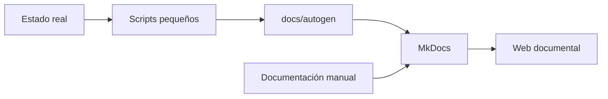

# Autodocumentación

## Objetivo

Mantener la documentación viva sin convertir el laboratorio en una plataforma compleja de inventario o monitorización.

## Modelo propuesto

La documentación tendrá dos capas:

### 1. Documentación humana

Decisiones, arquitectura, razones y procedimientos. Se mantiene manualmente porque requiere contexto.

### 2. Datos autogenerables

Información factual que un script puede obtener del sistema, por ejemplo:

- contenedores activos;
- puertos publicados;
- uso de disco;
- versión de Docker;
- repositorios clonados;
- interfaces e IPs;
- estado de UFW.

## Evolución prevista

!!! info "Criterio"
    La automatización se incorporará solo cuando la estructura manual sea estable. No se instalará un agente permanente únicamente para documentar.

## Regla de actualización

Cuando haya un cambio importante:

1. se crea una rama temática;
2. se actualiza la ficha afectada;
3. se registra la decisión si cambia arquitectura;
4. se añade una entrada breve al histórico de cambios;
5. se revisa mediante Pull Request;
6. se fusiona a `main`.
