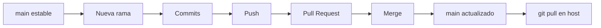

# Despliegue · Git

## Flujo normal

## Convención de ramas para esta documentación

Las ramas representan **cambios lógicos**, no archivos individuales.

Ejemplos:

- `docs/bootstrap-infra`
- `docs/app-salones`
- `docs/app-cartera`
- `docs/network`
- `docs/backups`

## Regla

!!! important "Main"
    `main` debe representar siempre la documentación aprobada y coherente con el estado real.
