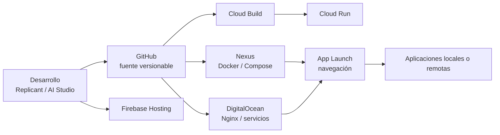

# Modelos de despliegue

Replicant Lab es deliberadamente heterogéneo: el runtime se elige por las necesidades de cada aplicación y no por una regla única.

| Aplicación | Creación / desarrollo | Deploy | Runtime |
|---|---|---|---|
| Salones AV | Codex / GitHub | Docker Compose | Nexus |
| Reserva-Pistas-UTP | Codex / GitHub | Compose en Nexus y despliegue controlado en VPS | Nexus + DigitalOcean |
| Consumos Cupra | AI Studio + Codex / GitHub | Cloud Build + Artifact Registry | Google Cloud Run |
| CV | AI Studio / GitHub | Despliegue manual observado | Firebase Hosting |
| Cartera Estratégica | Codex / desarrollo local | Ejecución local | Replicant |
| Control de Red | PowerShell + Codex | Ejecución local | Replicant |
| App Launch | Codex / GitHub | Scripts por destino | Nginx en Nexus y DigitalOcean |
| Replicant Lab | Codex / GitHub | Docker Compose | Nexus |

## Principios

- `Checkout ≠ Runtime`: un repositorio presente en un host puede ser solo una copia de consulta.
- `Tarjeta App Launch ≠ Runtime local`: una tarjeta es un enlace y no demuestra dónde se ejecuta la aplicación.
- App Launch es una capa de navegación; la autenticación, los datos y el ciclo de vida pertenecen a cada aplicación.
- Docker es el patrón principal en Nexus, no el único modelo del laboratorio.
