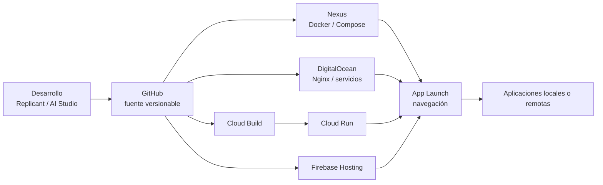
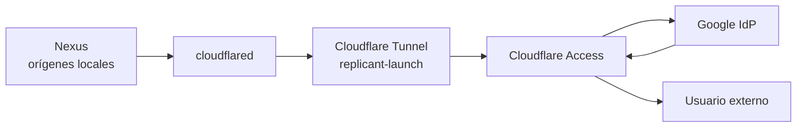

# Modelos de despliegue

Replicant Lab es deliberadamente heterogéneo: cada aplicación usa el runtime que mejor encaja con su función. La capa de publicación externa de Nexus se trata por separado del runtime.

## Flujo de desarrollo y despliegue

Firebase Hosting se representa al mismo nivel conceptual que Cloud Run: ambos son destinos cloud de publicación, aunque su mecanismo de build/deploy sea distinto.

## Publicación externa de Nexus

El diagrama anterior expresa responsabilidades, no el sentido físico de apertura de conexiones: `cloudflared` mantiene una conexión **saliente** hacia Cloudflare y el usuario nunca conecta directamente contra Nexus.

| Aplicación | Creación / desarrollo | Deploy | Runtime |
|---|---|---|---|
| Salones AV | Codex / GitHub | Docker Compose | Nexus |
| Reserva-Pistas-UTP | Codex / GitHub | Compose en Nexus y despliegue controlado en VPS | Nexus + DigitalOcean |
| Consumos Cupra | AI Studio + Codex / GitHub | Cloud Build + Artifact Registry | Google Cloud Run |
| CV | AI Studio / GitHub | Despliegue Firebase | Firebase Hosting |
| Cartera Estratégica | Codex / GitHub | Docker Compose | Nexus · `8085` |
| Control de Red | PowerShell + Codex | Ejecución local + demo aislada | Replicant + demo Nexus |
| App Launch | Codex / GitHub | Scripts por destino | Nginx en Nexus y DigitalOcean |
| Replicant Lab | Codex / GitHub | Docker Compose | Nexus |

## Principios

- `Checkout ≠ Runtime`: un repositorio presente en un host puede ser solo una copia de consulta.
- `Tarjeta App Launch ≠ Runtime local`: una tarjeta es navegación y no demuestra dónde se ejecuta la aplicación.
- `Tunnel ≠ Autenticación`: Cloudflare Tunnel transporta tráfico; Access + Google aplican identidad y autorización.
- App Launch es una capa de navegación; la autenticación, los datos y el ciclo de vida pertenecen a cada aplicación o a su perímetro de acceso.
- Docker es el patrón principal en Nexus, no el único modelo del laboratorio.

## Estado de Cloudflare

El Tunnel `replicant-launch` publica cinco servicios Nexus mediante hostnames independientes. Cada hostname tiene su propia aplicación y política Cloudflare Access con Google como IdP. El router no usa port forwarding para esta publicación.

El Launch de DigitalOcean no se sustituye automáticamente por el Launch de Nexus: ambos siguen siendo destinos distintos hasta que exista una decisión explícita de retirada o redirección.
