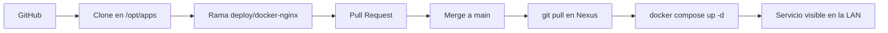

# Fase 05 · PoC Salones AV

## Objetivo

Validar el patrón completo con una aplicación real y simple.

## Flujo probado

## Resultado

- Repo: `ratienza/salones-av-valencia-palace`.
- Ruta: `/opt/apps/salones-av-valencia-palace`.
- Imagen: `nginx:alpine`.
- Contenedor: `salones-av`.
- Puerto: `192.168.18.220:8081 → 80/tcp`.
- HTML montado en solo lectura desde `proyecto_html`.

El PoC confirma el patrón **GitHub → Nexus → Docker → LAN**.
