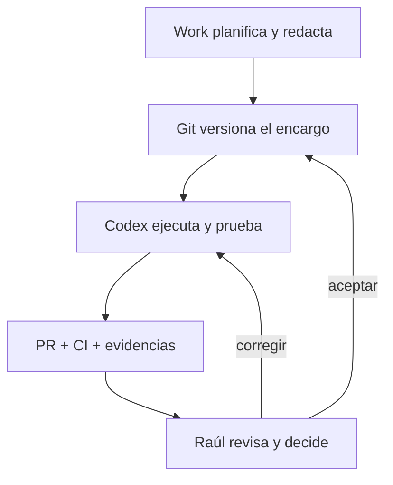
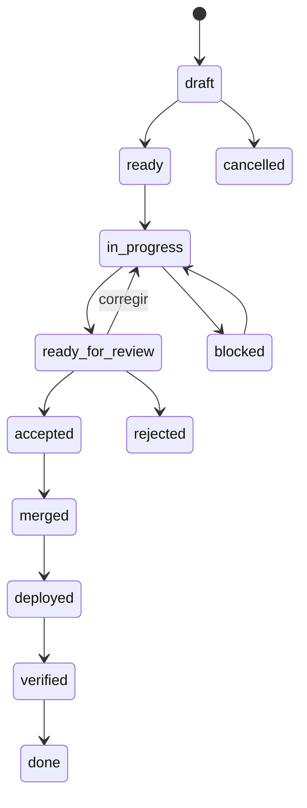
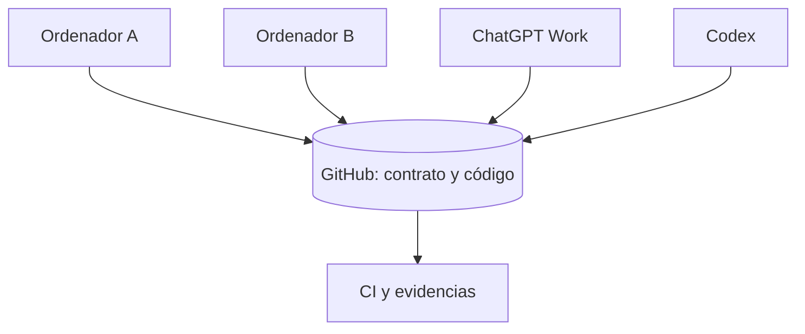

# Gobierno del trabajo

Este contrato permite retomar un proyecto desde cualquier ordenador o conversación sin depender de memoria de chat. GitHub conserva contrato, implementación y evidencias; el runtime demuestra únicamente lo desplegado.

## Roles y fuentes de verdad

| Actor | Responsabilidad |
|---|---|
| Raúl · Product Owner | Prioriza, autoriza riesgos, acepta y decide merge/despliegue. |
| ChatGPT Work · Project Manager | Planifica, redacta encargos, revisa pruebas y prepara decisiones. |
| Codex · Ejecución | Implementa en la rama indicada, prueba, documenta y publica evidencias. |
| GitHub + CI | Conserva la verdad técnica y ejecuta verificaciones automáticas. |
| Runtime | Evidencia la versión realmente desplegada; nunca sustituye a Git. |

Jerarquía operativa: instrucciones del Proyecto de Work → `AGENTS.md` aplicable → roadmap/estado canónico → `docs/encargos/<ID>.md` → rama y PR → evidencias → merge → despliegue → verificación. Una capa no autoriza silenciosamente la siguiente.

## Ciclo y estados

Planificación → encargo en Git → ejecución → PR y evidencias → revisión → corrección o aceptación → merge autorizado → despliegue autorizado → verificación → siguiente encargo. Una fase puede agrupar varios encargos, pero cada encargo lógico usa una rama propia.

Estados permitidos: `draft`, `ready`, `in_progress`, `ready_for_review`, `accepted`, `merged`, `deployed`, `verified`, `done`, `blocked`, `rejected` y `cancelled`.

| Evidencia | Significado exacto |
|---|---|
| Rama | Trabajo aislado; no está en `main`. |
| PR | Propuesta revisable; no está fusionada. |
| CI verde | Pruebas automáticas superadas; no es aceptación humana. |
| `main` | Historia canónica fusionada; no acredita despliegue. |
| Runtime | Versión observable en un entorno; debe identificarse con SHA. |
| Verificación | Comprobación posterior al despliegue de SHA, salud y comportamiento. |

## Chats y varios ordenadores

- Nuevo encargo: nueva conversación de Codex.
- Corrección del mismo encargo: misma conversación y rama.
- Nuevo resultado importante de Work: chat separado dentro del Proyecto.
- Cambio de `AGENTS.md`: reiniciar Codex antes del siguiente encargo.

Para retomar: entrar en el repositorio correcto, comprobar árbol limpio, hacer `fetch`, actualizar la base sin destruir cambios, iniciar Codex desde la raíz, indicar proyecto e ID exactos y verificar que se cargaron `AGENTS.md` y el encargo.

## Coordinación multirrepositorio

El encargo enumera repositorios afectados y no afectados. Para cada uno registra rama, PR, SHA, CI y estado individual; además declara dependencias, orden de merge/despliegue y rollback. Nunca se resume todo como “verde” si un repositorio permanece pendiente.

## Matriz de impacto documental

| Cambio | Actualización obligatoria |
|---|---|
| Estado de encargo | Roadmap, board o estado canónico |
| Funcionalidad | README y documentación de usuario |
| Arquitectura | ADR y diagramas |
| Despliegue | Runbook, URL, versión y SHA |
| Varios repositorios | Manifiesto coordinador |
| Hito aceptado | Changelog y cierre |
| Regla recurrente | `AGENTS.md` |

“Automático” significa actualizar solo la documentación afectada y comprobar coherencia cuando sea posible; no regenerar indiscriminadamente todo.

## Definición de terminado

Un encargo termina cuando cumple criterios, pruebas y documentación; sus evidencias son accesibles; la aceptación está registrada; y, cuando corresponda, merge, despliegue y verificación tienen SHA y resultado propios. `ready_for_review` no equivale a `accepted`.

## Checklist de reanudación

- [ ] Repositorio y remoto correctos.
- [ ] Árbol limpio y `origin/main` actualizado.
- [ ] `AGENTS.md` y encargo exacto leídos.
- [ ] Rama, SHA base, estado y autorizaciones confirmados.
- [ ] Dependencias multirrepositorio identificadas.
- [ ] Último PR, CI, evidencias y runtime contrastados por separado.
- [ ] Siguiente gate y siguiente acción explícitos.

## Antipatrones prohibidos

No usar “ejecuta lo último”; guardar el contrato solo en chat; editar `main`; reutilizar ramas ajenas; mezclar repositorios; confundir CI con aceptación; afirmar despliegue por existir un merge; declarar verificación sin observar runtime; cerrar aceptación visual con capturas locales; ni resolver colisiones silenciosamente.

Consulta también el [sistema de encargos](../encargos/README.md) y el [bloque para Work](instrucciones-proyecto-work.md).
