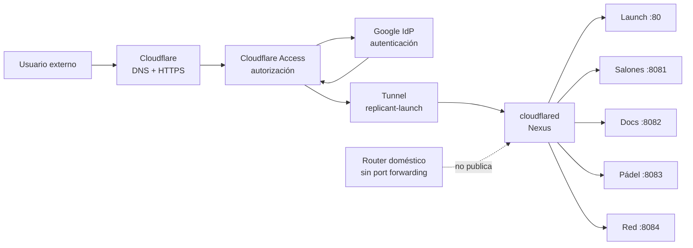

# Cloudflare · publicación externa segura

Guía canónica de publicación externa de Replicant Lab. Documenta el estado implantado de **Cloudflare Tunnel + Cloudflare Access + Google IdP** para servicios seleccionados de Nexus.

!!! success "Estado vigente"
    **Implementado:** un único Tunnel `replicant-launch`, cinco hostnames públicos, Google como IdP y una aplicación/política Access independiente por hostname.

    **Pendiente operativo:** merge/despliegue del catálogo Nexus corregido en `Apps_Lauch#15`, prueba autenticada desde móvil de cada aplicación y monitorización/alertas del Tunnel.

    **No implantado:** Authentik. Se conserva únicamente como posible evolución futura.

## Objetivo

Publicar servicios de Nexus desde Internet sin abrir puertos entrantes en el router doméstico y sin exponer directamente la IP pública de la vivienda.

`cloudflared` se ejecuta en Nexus y mantiene una conexión **saliente** con Cloudflare. Cloudflare proporciona DNS, HTTPS, autenticación mediante Google y autorización mediante Access antes de entregar tráfico al Tunnel.

## Arquitectura



### Regla esencial

**Tunnel ≠ autenticación.** El Tunnel transporta tráfico. **Google** autentica la identidad y **Cloudflare Access** decide si esa identidad puede entrar en cada aplicación.

Compartir Tunnel tampoco comparte permisos: cada hostname tiene una aplicación Access y una política independiente.

## Inventario implantado

| Aplicación Access | Hostname | Origen en Nexus |
|---|---|---|
| Replicant Launch | `launch.thereplicantlab.com` | `http://localhost:80` |
| Replicant Salones | `salones.thereplicantlab.com` | `http://192.168.18.220:8081` |
| Replicant Docs | `docs.thereplicantlab.com` | `http://192.168.18.220:8082` |
| Replicant Padel | `padel.thereplicantlab.com` | `http://192.168.18.220:8083` |
| Replicant Red | `red.thereplicantlab.com` | `http://192.168.18.220:8084` |

Configuración registrada en RL-CF-002:

- un único Tunnel: `replicant-launch`;
- CNAME proxied para los cinco hostnames;
- aplicación Access `self_hosted` independiente por hostname;
- Google como IdP;
- redirección directa al IdP;
- política `Allow` independiente;
- sesión configurada a 24 horas;
- fallback final del Tunnel: `http_status:404`;
- sin reglas `Bypass` como atajo.

No se versionan tokens, secretos OAuth, cookies ni direcciones de correo completas.

## Flujo de una solicitud

1. El usuario abre uno de los hostnames de `thereplicantlab.com`.
2. Cloudflare resuelve DNS y termina HTTPS.
3. Cloudflare Access comprueba si existe una sesión válida.
4. Cuando necesita identidad, Access redirige a Google.
5. Google autentica al usuario y devuelve el resultado a Access.
6. Access evalúa la política de **ese hostname**.
7. Si la política permite el acceso, Cloudflare entrega la petición al Tunnel `replicant-launch`.
8. `cloudflared` en Nexus transporta la petición hasta el origen local correspondiente.
9. La respuesta vuelve por el mismo camino.

El router no recibe una conexión entrante reenviada hacia Nexus.

## LAN: sin cambios

Cloudflare protege la **ruta externa**, no la LAN. Los accesos locales siguen funcionando por IP/puerto y no requieren Google ni Access.

| Servicio | Acceso LAN |
|---|---|
| App Launch | Nexus, puerto `80` |
| Salones AV | Nexus, puerto `8081` |
| Replicant Lab | Nexus, puerto `8082` |
| Reserva Pistas UTP | Nexus, puerto `8083` |
| Control de Red | Nexus, puerto `8084` |

No se ha implantado DNS local nuevo, HTTPS interno ni cambios generales de binding como parte de RL-CF-002.

## Qué protege y qué no protege

Cloudflare Access protege el **hostname publicado**. No protege automáticamente:

- el acceso LAN directo por IP;
- una URL pública directa de un proveedor externo;
- una aplicación remota solo porque aparezca enlazada desde App Launch;
- otros hostnames que no tengan su propia aplicación/política Access.

Para una aplicación alojada fuera de Nexus hay que diseñar su protección de forma independiente y, cuando sea posible, impedir que la URL directa del origen evite el control de acceso.

## Operación segura de cloudflared

### Consulta

```bash
cloudflared --version
systemctl is-active cloudflared
systemctl is-enabled cloudflared
systemctl status cloudflared --no-pager

curl -I http://localhost:80/
curl -I https://launch.thereplicantlab.com/
```

### Logs

```bash
sudo journalctl -u cloudflared -n 100 --no-pager
```

Antes de compartir logs, revisar que no contengan valores sensibles.

### Reinicio controlado

```bash
sudo systemctl restart cloudflared
```

El reinicio interrumpe temporalmente el acceso externo. Después deben comprobarse servicio, origen local y al menos un acceso externo autenticado.

### Instalación o revinculación

```bash
sudo apt install cloudflared
sudo cloudflared service install <TUNNEL_TOKEN>
sudo systemctl enable --now cloudflared
```

El token es secreto: se utiliza únicamente mediante el mecanismo seguro de instalación y nunca se documenta ni versiona.

## Validación registrada

- [x] Tunnel remoto sano.
- [x] `cloudflared` activo y habilitado en Nexus.
- [x] Cinco hostnames configurados.
- [x] Cinco aplicaciones Access independientes.
- [x] Cinco políticas sin `Bypass`.
- [x] Google acepta el callback de Access; desapareció `redirect_uri_mismatch`.
- [x] Orígenes Nexus responden en LAN.
- [x] Launch autenticado registrado correctamente en Access.
- [x] Router sin port forwarding para esta arquitectura.
- [ ] Merge y despliegue de `Apps_Lauch#15`.
- [ ] Prueba autenticada desde móvil de Launch, Salones, Docs, Pádel y Red tras desplegar el catálogo.
- [ ] Monitorización y alertas del Tunnel.
- [ ] Procedimiento de recuperación probado después de reinicio controlado.

### Secuencia inicial preservada de Launch

La implantación inicial quedó documentada antes de ampliar el Tunnel a los cinco hostnames actuales:

1. La versión 2 de la configuración contenía dos reglas idénticas para `launch.thereplicantlab.com`.
2. La versión 3 eliminó la duplicada y conservó una sola ruta hacia `http://localhost:80`.
3. La versión 4 incorporó el estado final de cinco hostnames y el fallback `http_status:404`.

Google aceptó exactamente `https://shy-pine-78cc.cloudflareaccess.com/cdn-cgi/access/callback`. La política inicial se denominó `Allow · Replicant Launch · authorized emails`; la corrección no modificó su decisión `Allow`, prioridad ni reglas de inclusión. Sin sesión, tanto `/` como `/apps.json` devolvieron el mismo HTTP `302` hacia el inicio de sesión de Access.

#### Reversión controlada

- Restaurar la versión previa de ingress solo si retirar la regla duplicada provoca una regresión comprobada.
- Restaurar el nombre anterior de la política sin cambiar decisión, prioridad ni reglas.
- Retirar únicamente el callback añadido si se revierte por completo Access; no alterar otros URI y no copiar secretos OAuth.
- Tras cualquier reversión, comprobar Tunnel, origen LAN y respuestas externas de `/` y `/apps.json`.

## Troubleshooting

| Síntoma | Comprobar primero | Interpretación |
|---|---|---|
| El hostname no resuelve | DNS y CNAME proxied | Problema de publicación/DNS |
| Error 1033 | Estado del Tunnel y `cloudflared` | Cloudflare no encuentra un conector sano |
| Login de Google falla | Callback OAuth y configuración IdP | Problema de identidad, no del origen |
| Access deniega | Política del hostname | La identidad no cumple la regla |
| Access permite pero la app falla | Origen local en Nexus | Fallo de aplicación/origen |
| Funciona en LAN pero no externamente | Access, Tunnel y ruta publicada | No abrir puertos como atajo |
| Una URL directa evita Access | Arquitectura del origen remoto | Proteger dominio propio o cerrar acceso directo |
| Bucle HTTPS/redirección | Hostname, Access y redirecciones del origen | Evitar redirecciones improvisadas |

## Authentik

Authentik + Google **no forma parte del runtime actual**.

Podría ser útil si el Lab evoluciona hacia identidad autocontrolada, grupos/roles complejos, múltiples IdP, aplicaciones fuera de Cloudflare o políticas más avanzadas. A cambio introduce nuevos contenedores, persistencia, backups, actualizaciones, monitorización y disponibilidad.

La arquitectura actual se mantiene deliberadamente más simple:

**Cloudflare Access + Google = solución activa.**

**Authentik = opción futura, no prioridad.**

## Relación con DigitalOcean

Nexus y DigitalOcean cumplen papeles distintos. Cloudflare Tunnel publica servicios del Lab alojados en Nexus; no sustituye automáticamente el VPS ni sus servicios 24×7.

El App Launch de DigitalOcean permanece operativo hasta que exista una auditoría y decisión explícita de retirada, redirección o consolidación.

## Referencias internas

- [Arquitectura](../arquitectura.md)
- [Red · visión general](overview.md)
- [Host · Nexus](../hosts/nexus.md)
- [Aplicación · App Launch](../aplicaciones/app-launch.md)
- [Encargo RL-CF-002](../encargos/RL-CF-002.md)
