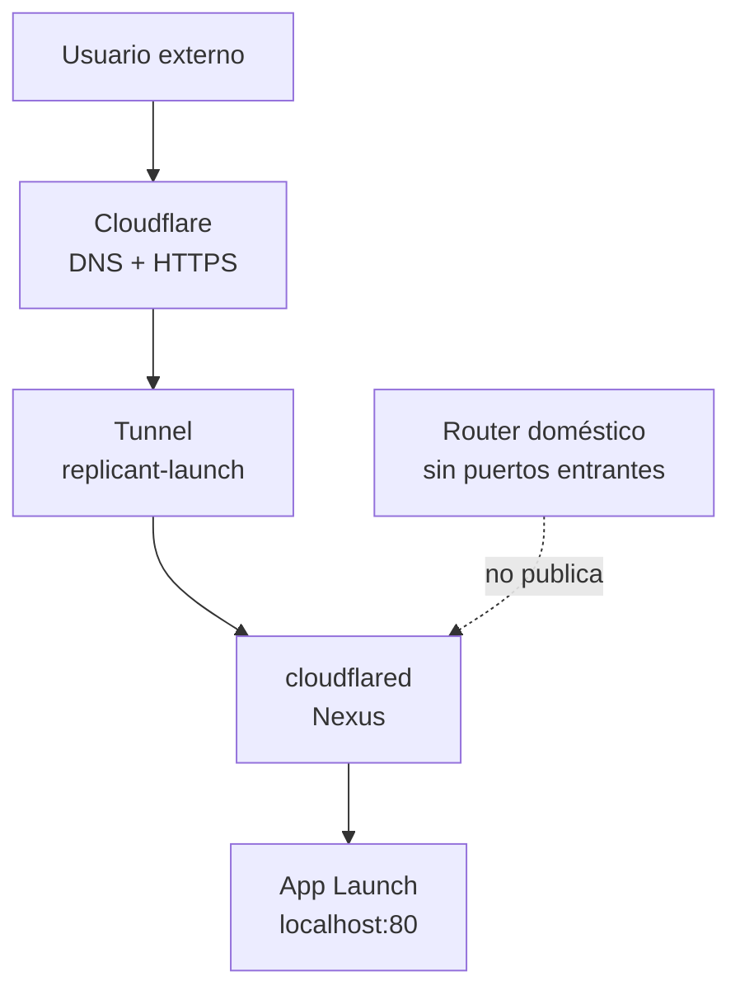
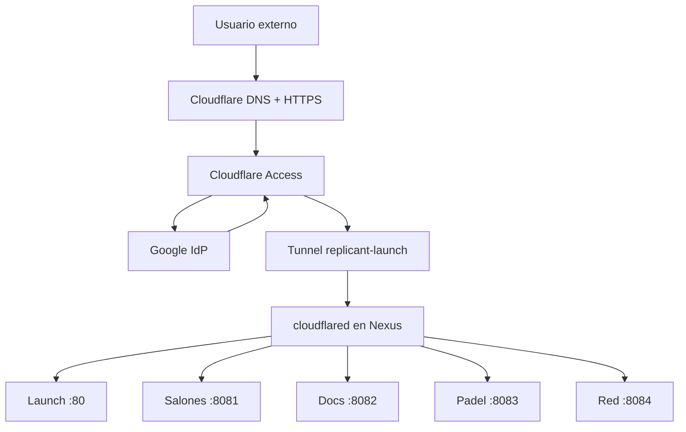
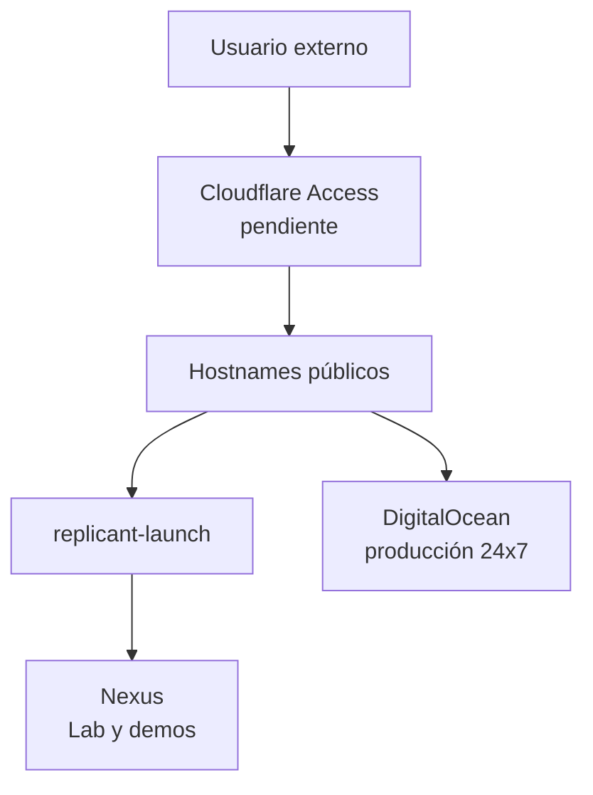

# Cloudflare Tunnel

Guía canónica de publicación externa de Replicant Lab. Describe el estado implantado de Cloudflare Tunnel, Google como proveedor de identidad y la autorización independiente de cada hostname mediante Cloudflare Access.

!!! important "Estado vigente"
    **Implementado:** un único Tunnel `replicant-launch`, cinco hostnames públicos, Google como IdP y una aplicación/política Access independiente por hostname.
    **Validado:** configuración estructural de DNS, Tunnel y Access; autenticación correcta de Launch y catálogo local sano.
    **Pendiente de merge/despliegue:** el cambio de enlaces del catálogo Nexus se revisa en `Apps_Lauch#15`.
    **Evolución futura opcional:** Authentik + Google. No forma parte del runtime actual.

## Propósito

La finalidad actual es publicar App Launch externamente sin abrir puertos entrantes en el router doméstico. Nexus continúa en la LAN; `cloudflared` inicia una conexión **saliente** hacia Cloudflare y Cloudflare entrega DNS, HTTPS público y el transporte hasta el origen local. No hay exposición directa de la IP pública doméstica.

## Arquitectura actual



| Elemento | Valor actual | Función |
|---|---|---|
| Dominio | `thereplicantlab.com` | Zona gestionada en Cloudflare |
| Hostname | `launch.thereplicantlab.com` | Entrada pública existente |
| Tunnel | `replicant-launch` | Transporte saliente seguro |
| Conector | `cloudflared` en Nexus | Mantiene la conexión con Cloudflare |
| Origen | `http://localhost:80` | App Launch servido por Nexus |
| Router | Sin puertos entrantes | Nexus no se expone directamente |

`localhost:80` se interpreta desde Nexus, donde se ejecuta `cloudflared`; no es una dirección accesible directamente desde Internet. El origen responde en el host y App Launch se publica en el puerto `80` de Nexus para la LAN.

### Flujo de una solicitud

1. El usuario abre `https://launch.thereplicantlab.com`.
2. Cloudflare resuelve el hostname y termina HTTPS público.
3. Cloudflare identifica el Tunnel `replicant-launch` asociado a la ruta publicada.
4. `cloudflared` mantiene desde Nexus una conexión saliente con Cloudflare.
5. La petición cruza esa conexión hasta `http://localhost:80`.
6. Nexus entrega App Launch y la respuesta vuelve por el Tunnel.
7. El router no recibe ni reenvía una conexión entrante; la IP pública doméstica no es el origen accesible de la aplicación.

## Dominio, Zero Trust y rutas

`thereplicantlab.com` está registrado y gestionado desde Cloudflare. Cloudflare Zero Trust Free está activado. Estas acciones son distintas:

| Acción | Significado |
|---|---|
| Registrar dominio | Adquirir o mantener la titularidad del dominio |
| Gestionar DNS | Administrar la zona y sus registros |
| Crear Tunnel | Asociar un transporte saliente a un conector |
| Publicar una ruta | Vincular hostname, Tunnel y origen |
| Crear aplicación Access | Definir el recurso que se protegerá |
| Configurar identidad | Conectar Google u otro proveedor de identidad |

Una **Published application route** representa la publicación de una aplicación mediante un hostname público y un origen. En la interfaz, **Hostname routes** expresa esa relación desde el punto de vista del hostname. Para la ruta actual ambas denominaciones describen el mismo vínculo: `launch.thereplicantlab.com` → `replicant-launch` → `http://localhost:80`.

No hay rutas privadas documentadas en este encargo. Solo existe la ruta pública anterior; cualquier hostname adicional citado más abajo es diseño futuro y no debe crearse sin autorización.

## Estado comprobado

| Comprobación | Resultado | Alcance |
|---|---|---|
| Servicio `cloudflared` | Activo y habilitado en Nexus | Observado el 06/09/2026 |
| Conector | Versión instalada observada; configuración no inspeccionada | Sin leer token ni ficheros secretos |
| Origen local | `http://localhost:80` devolvió HTTP `200` | Nexus |
| Hostname público | `https://launch.thereplicantlab.com/` devolvió HTTP `200` | Externo desde Replicant |
| Prueba móvil | Correcta según la evidencia de implantación | No repetida en esta auditoría |
| Router | Sin port forwarding según la decisión implantada | No administrado ni modificado en esta auditoría |

El Tunnel publica el origen de forma segura, pero por sí solo **no autentica usuarios**. Cloudflare Access + Google todavía no está implementado.

## Acceso LAN: sin cambios

La seguridad externa no modifica la LAN. No se requiere Cloudflare Access, Google OAuth, FQDN interno, HTTPS interno, cambios de binding ni modificación de puertos para los accesos locales actuales.

| Servicio | Acceso LAN |
|---|---|
| App Launch | Nexus, puerto `80` |
| Salones AV | Nexus, puerto `8081` |
| Replicant Lab | Nexus, puerto `8082` |
| Reserva Pistas UTP | Nexus, puerto `8083` |
| Control de Red demo | Nexus, puerto `8084` |
| Otros servicios | Según el inventario vigente |

Un posible rediseño de seguridad interna queda fuera de alcance hasta una decisión explícita.

## Operación de cloudflared

Los ejemplos son procedimientos reproducibles para Ubuntu 24.04. Nunca deben incluir ni sustituir los marcadores por valores reales en Git. **No se ejecutan en este encargo** los comandos que instalan, vinculan, reinician o eliminan componentes.

### Consulta segura

```bash
# Solo consulta: versión y estado del servicio
cloudflared --version
systemctl is-active cloudflared
systemctl is-enabled cloudflared
systemctl status cloudflared --no-pager

# Solo consulta: comprobar origen y hostname
curl -I http://localhost:80/
curl -I https://launch.thereplicantlab.com/
```

### Instalación y vinculación

```bash
# MODIFICA el host: instalar paquete según el repositorio oficial de Cloudflare
sudo apt install cloudflared

# MODIFICA el host y contiene un secreto: vincular el conector existente
sudo cloudflared service install <TUNNEL_TOKEN>

# MODIFICA el servicio: iniciar y habilitar tras validar la configuración
sudo systemctl enable --now cloudflared
```

Antes de instalar o vincular, confirmar cuenta, Tunnel y host objetivo. El token solo se utiliza en el mecanismo seguro de instalación; nunca se muestra, registra ni versiona.

### Logs, actualización y reinicio controlado

```bash
# Solo consulta: últimas líneas del servicio; revisar que no contengan secretos antes de compartirlas
sudo journalctl -u cloudflared -n 100 --no-pager

# MODIFICA paquetes: actualizar de forma controlada
sudo apt update
sudo apt install --only-upgrade cloudflared

# INTERRUMPE temporalmente el acceso externo: reiniciar solo tras plan de rollback
sudo systemctl restart cloudflared
```

Tras cualquier cambio, comprobar el servicio, el origen local y el hostname desde una red externa. Para rollback, volver al paquete/configuración conocida sin copiar secretos a Git y reiniciar de forma controlada. La desinstalación o eliminación de un servicio/Tunnel es destructiva para el acceso externo y requiere un encargo separado, respaldo operativo y validación posterior.

## Checklist de validación

- [x] DNS/hostname público responde para la ruta actual.
- [x] HTTPS y App Launch responden para `launch.thereplicantlab.com`.
- [x] `cloudflared` está activo y habilitado en Nexus.
- [x] El puerto local `80` responde en Nexus.
- [x] La prueba externa desde datos móviles fue correcta en la implantación.
- [x] El router no usa port forwarding para esta publicación.
- [ ] Validar el comportamiento después de reiniciar `cloudflared` — no verificado en esta auditoría.
- [ ] Implementar monitorización/alertas del Tunnel.

## Troubleshooting seguro

| Síntoma | Diagnóstico seguro | Acción permitida |
|---|---|---|
| El dominio no resuelve | Comprobar hostname y DNS desde una red externa | Revisar la ruta publicada en Cloudflare; no abrir puertos |
| Error 1033 | Consultar estado de `cloudflared` y conexión del Tunnel | Recuperar el conector con el procedimiento controlado |
| Tunnel desconectado o servicio detenido | `systemctl status cloudflared --no-pager` | Investigar logs sin exponer secretos; reiniciar solo con autorización |
| Origen no disponible | `curl -I http://localhost:80/` en Nexus | Reparar App Launch como servicio independiente; no cambiar router |
| Puerto 80 no responde | Comprobar Compose/App Launch y listeners del host | Restaurar el servicio local mediante su repositorio y procedimiento |
| Ruta publicada incorrecta | Contrastar hostname, Tunnel y origen en la consola Cloudflare | Corregir solo con autorización específica |
| Error HTTPS o bucle | Comprobar hostname público y redirecciones | Revisar Cloudflare/origen sin introducir redirecciones improvisadas |
| Funciona en LAN pero no desde móvil | Comparar origen local, Tunnel y DNS externo | No usar port forwarding como atajo |
| Cloudflare responde pero App Launch no | Verificar HTTP local en `localhost:80` | Tratarlo como fallo del origen, no del DNS |
| App funciona localmente pero el Tunnel no | Verificar servicio y estado del Tunnel | Diagnosticar con Cloudflare, sin tocar aplicaciones |
| Acceso público cuando se esperaba autenticación | Confirmar aplicación y política Access del hostname | Corregir la política; nunca usar `Bypass` como atajo |

## Cloudflare Access + Google

Cloudflare Access está implantado. Google autentica la identidad y Access autoriza cada hostname; el Tunnel solo transporta tráfico. Cada aplicación tiene una política `Allow` independiente y, en la implantación inicial, una única cuenta autorizada. Conocer la URL no evita Access.

| Aplicación Access | Hostname | Origen del Tunnel | Política inicial |
|---|---|---|---|
| Replicant Launch | `launch.thereplicantlab.com` | `http://localhost:80` | Correo autorizado |
| Replicant Salones | `salones.thereplicantlab.com` | `http://192.168.18.220:8081` | Correo autorizado |
| Replicant Docs | `docs.thereplicantlab.com` | `http://192.168.18.220:8082` | Correo autorizado |
| Replicant Padel | `padel.thereplicantlab.com` | `http://192.168.18.220:8083` | Correo autorizado |
| Replicant Red | `red.thereplicantlab.com` | `http://192.168.18.220:8084` | Correo autorizado |



Las sesiones pueden reutilizar la autenticación del mismo IdP, pero Access vuelve a evaluar la política de cada hostname. Los accesos LAN por IP y puerto no cambian. Las aplicaciones alojadas en otros proveedores no quedan protegidas por aparecer en Launch: para ellas hay que proteger un dominio propio y cerrar, cuando sea posible, la URL directa del origen.

## Authentik + Google

!!! note "EVOLUCIÓN FUTURA OPCIONAL / NO PRIORITARIA"
    Authentik no es un requisito actual ni debe instalarse en esta fase.

Authentik + Google podría aportar identidad autocontrolada, independencia parcial de Cloudflare, roles/grupos complejos, varios proveedores de identidad, aplicaciones fuera de Cloudflare y políticas avanzadas. Su coste es operar nuevos contenedores, base de datos, actualizaciones, backups, disponibilidad, monitorización y mayor complejidad.

> Cloudflare Access + Google es la solución principal para la siguiente fase de seguridad. Authentik queda reservado como posible evolución avanzada si Replicant Lab crece y necesita una capa de identidad más independiente o compleja.

## Nexus, DigitalOcean y crecimiento

Nexus es el servidor Linux local del Lab y el origen actual de App Launch; puede publicar herramientas, demos y aplicaciones seleccionadas mediante Tunnel sin quedar expuesto directamente por el router. Su acceso LAN permanece intacto.

DigitalOcean sigue siendo producción `24×7` para aplicaciones que necesiten disponibilidad continua, que deban sobrevivir a una caída de Nexus/vivienda/conexión doméstica o que manejen estado productivo. Cloudflare Tunnel no convierte automáticamente Nexus en sustituto de DigitalOcean.

Existe un Launch en Nexus y existe o ha existido otro en DigitalOcean. El Launch de Nexus publicado mediante `launch.thereplicantlab.com` es candidato a Launch público canónico; mantener los dos solo tiene sentido con una estrategia real de alta disponibilidad. No se retira todavía el Launch de DigitalOcean. Antes de retirarlo o redirigirlo se deben auditar dependencias y enlaces, decidir redirecciones, conservar rollback, actualizar documentación y validar que no afecte a servicios productivos.

```text
replicant-launch      → Nexus         → Lab, demos y herramientas
replicant-production  → DigitalOcean  → posible evolución de producción
```

`replicant-launch` existe. `replicant-production` no existe: es un modelo conceptual, no debe crearse. DigitalOcean no necesita ahora otro Tunnel; conectarlo como réplica del mismo solo tendría sentido para servicios idénticos y alta disponibilidad. Las políticas de Access serían centrales, no se duplicarían por servidor.



## Publicación de aplicaciones mediante el mismo Tunnel

El mismo Tunnel publica varias aplicaciones con hostnames distintos; no existe un Tunnel por aplicación. Todas las reglas se sitúan antes del fallback `http_status:404` y no se abre ningún puerto del router.

| Hostname | Origen Nexus | Estado |
|---|---|---|
| `launch.thereplicantlab.com` | `http://localhost:80` | Implementado |
| `salones.thereplicantlab.com` | `http://192.168.18.220:8081` | Implementado |
| `docs.thereplicantlab.com` | `http://192.168.18.220:8082` | Implementado |
| `padel.thereplicantlab.com` | `http://192.168.18.220:8083` | Implementado |
| `red.thereplicantlab.com` | `http://192.168.18.220:8084` | Implementado |

## Pendientes reales

1. Revisar y desplegar el cambio del catálogo Nexus propuesto en `Apps_Lauch#15`.
2. Validar desde móvil cada hostname tras la autenticación y registrar el resultado.
3. Monitorizar el Tunnel, configurar alertas y revisar backups de configuración no secreta.
4. Auditar por separado las URLs directas de aplicaciones alojadas en AI Studio, Firebase, Cloud Run o DigitalOcean.
5. Auditar el Launch duplicado de DigitalOcean antes de decidir retirada o redirección.