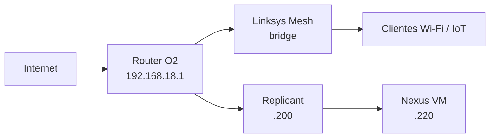

# Red · Visión general

## Topología

## Convención provisional

| Rango | Uso previsto |
|---|---|
| `.1` | Router / gateway |
| `.2-.19` | Infraestructura de red / mesh |
| `.20-.179` | Clientes, IoT y DHCP general |
| `.180-.199` | Equipos fijos, NAS, impresoras |
| `.200-.219` | Servidores físicos |
| `.220-.239` | VMs / laboratorio |
| `.240-.254` | Reserva futura |

## DNS

No existe servidor DNS local. Replicant mantiene dos aliases puntuales en el archivo `hosts` de Windows:

| Nombre | IP | Uso |
|---|---|---|
| `replicant` | `192.168.18.200` | Escritorio remoto y herramientas del host |
| `nexus` | `192.168.18.220` | SSH y `http://nexus/` |

El alias solo resuelve el nombre. El protocolo, puerto, usuario y credenciales siguen perteneciendo a cada servicio.
